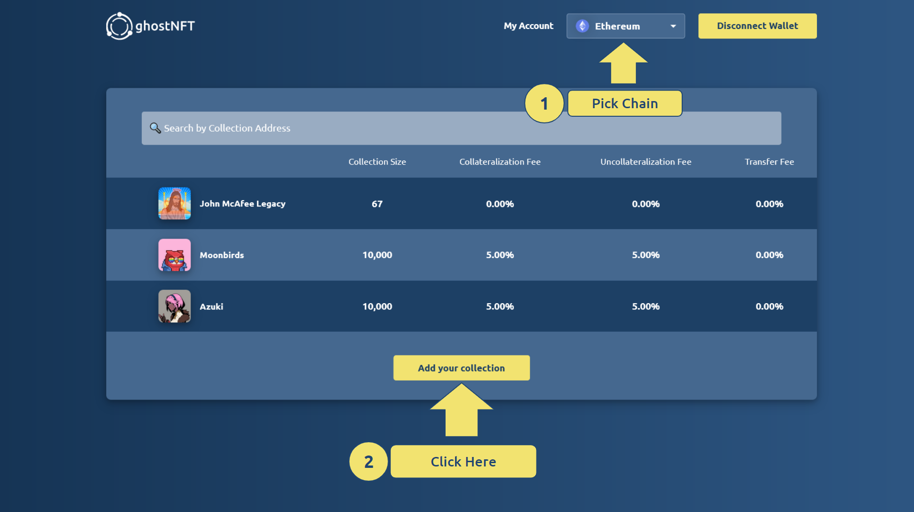
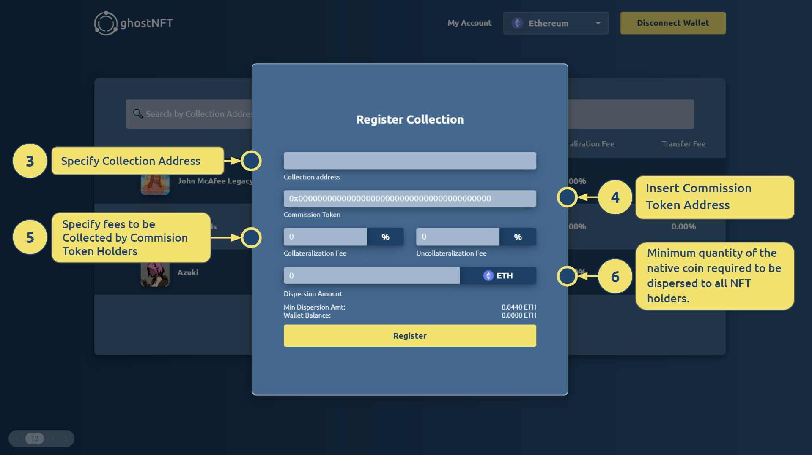

.. _envious-house-usage:

##################
EnviousHouse Usage
##################

*******
Concept
*******

This section contains a more comprehensive overview of the EnviousHouse smart contract.

The EnviousHouse contract enables any already deployed ERC721 collection to upgrade to the ERC721Envious standard and gain collateral functionality by simply calling the ``registerCollection`` function. This allows any NFT collection to become envious and take advantage of the benefits offered by the ERC721Envious standard.

.. code-block:: Solidity

  function registerCollection(address collection, address token, uint256 incoming, uint256 outcoming) external payable override

``registerCollection`` function will require the following parameters:

* Collection address
* ``measurementToken`` address
* Incoming fee (collateralization fee)
* Outcoming fee (uncollateralization fee)

Simply insert an NFT collection address to access EnviousHouse functionality. More information can be found in `EnviousHouse Specifications <envious-house.html>`_.

.. warning::

  Every NFT Collection can only be registered once, and the set parameters cannot be reversed or updated. It is crucial to ensure that the set parameters are aligned with the goals of the project.

*****************************
ERC721 Collection Integration
*****************************

This section provides instructions on how to add an ERC721 NFT collection to `ghostNFT <https://nft.ghostchain.io/>`_. The process comprises six straightforward steps that can be completed in less than two minutes.

**Definitions:**

======================= ===============================================================================
Term                    Description
======================= ===============================================================================
Collection address      address of ERC721 NFT collection
Commission Token        ERC20 token that will
Collateralization Fee   percentage fee charged from every collateral deposit
Uncollateralization Fee percentage fee change from every collateral redemption
Dispersion Amount       minimum amount of the native coin required to register an ERC721 NFT collection
======================= ===============================================================================

.. warning::

  The ``Commission Token`` is an ERC20 token, therefore, do not input an externally owned account (EOA) address in the Commission Token field.

.. hint::

  Holders of ``Commission Token`` are granted exclusive access to exchange their tokens for ``Collateralization Fee`` and ``Uncollateralization Fee``.

.. hint::

  At the time of deployment, the ``Dispersion Amount`` was established at $69.00 in the native coin based on current market prices.

**Step 1.**
Please choose a blockchain network. `ghostNFT <https://app.nft.ghostchain.io/#/ethereum/>`__ is currently available on 16 EVM-compatible chains.

**Step 2.**
Press **Add your collection** button.

**Step 3.**
Provide the ``Collection Address``.

**Step 4.**
Provide the ``Commission Token``.

.. hint::

  It is advisable to either create a new ERC20 token specifically for use as a ``Commission Token``, or utilize an existing ERC20 token that already has a thriving community.

**Step 5.**
Set appropriate ``Collateralization Fee`` and ``Uncollateralization Fee``.

.. hint::

  The ``Collateralization Fee`` and ``Uncollateralization Fee`` should be established at appropriate levels to avoid discouraging users from adding collateral to the collection.

**Step 6.**
Set the ``Dispersion Amount``.

.. hint::

  ``Dispersion Amount`` fully goes to all tokenId holders.

That's it! Congratulations on successfully registering your ERC721 collection with ghostNFT!
